# Team1-GenomeAssembly
Mariam Nawaz, Pranoti Harkud, Logan Gloster, Zun Wang, Zack Mudge, Mannan Bhola, Yi-Ming Chen, Palak Aggarwal 

# Pipeline Installation and Instructions

## Overview of Assembly Pipeline
The assembly pipeline performs read trimming and de novo assembly given paired-end read files in FASTQ format. Initial read quality assessment and trimming are performed with FastQC and BBDuk, respectively. MultiQC is used to compile read quality metrics for all isolates into one quality assessment output. Assemblies are produced using SPAdes, and assembly quality reports are produced using QUAST.

### Trimming
Trims the left and right ends of each read using BBDuk, with a quality score threshold. The default setting for the assembly script is to start at Q5, and increase by 1 until the reads pass FastQC.
### De novo assembly
SPAdes produces assemblies for different k-mer sizes: 21, 33, 55, 77, 99, and 127. It chooses the optimal assembly from the individual assemblies.
### Assembly Quality
QUAST is used to report assembly quality metrics such as total length, N50, and number of contigs.

## Installing Dependencies
1. Install [conda](https://docs.conda.io/projects/conda/en/latest/user-guide/install/index.html) or [miniconda](https://docs.conda.io/en/latest/miniconda.html).
2. Copy `environment.yml` to a local directory. You can change the first line of `environment.yml` to specify the name for your environment.
3. Install dependencies: `conda env create -f environment.yml`
4. `conda activate <name_of_env>`

## Running Assembly Pipeline
### Usage and Options
See "Directory Structure" section below for more details on file placement.
    
       
    usage: assembly.py [-h] [--threshold THRESHOLD] [--skip_trimming] [--skip_quast] data_dir

    positional arguments:
    data_dir            Directory containing the original
                        <isolate_name>_1.fq.gz and <isolate_name>_2.fq.gz
                        files for each isolate OR, if the --skip-trimming
                        option is given, the directory containing the trimmed
                        and unzipped .fq files for each isolate

    optional arguments:
    -h, --help          show this help message and exit
    --threshold THRESHOLD
                        Trimming quality threshold to start at. E.g. 5 starts
                        trimming the read ends at Q5, and increases quality
                        threshold by 1 until trimmed reads pass FASTQC
    --skip_trimming     Skip trimming. If using this option, provide the
                        directory containing the trimmed reads as <data_dir>
    --skip_quast        Skip QUAST of final assemblies.

### Directory Structure    
    . 
    ├── assembly.py
    └───data_dir
        │
        └───CGT1005
        |        CGT1005_1.fq.gz
        |        CGT1005_2.fq.gz
        └───CGT1029
        |        CGT1029_1.fq.gz
        |        CGT1029_2.fq.gz
        ...

### Example: Running assembly pipeline in the background, redirecting stdout to `log.out`, and stderr to `log.err`
`nohup python -u assembly.py data/ > log.out 2> log.err &`

### Output locations
- `assemblies/`: Final assemblies (`contigs.fasta`). Also contains the QUAST outputs for all isolates if QUAST was not skipped.
- `spades_outputs/`: All of the outputs from SPAdes, including assemblies for different k-mer sizes. SPAdes finds the optimal k-mer size based on multiple runs. The assembly for the optimal k-mer size is copied to the `assemblies/` directory at the end.
- `trimmed/`: If trimming was not skipped, FASTQ files with trimmed reads.
- `fastqc/`: If trimming was not skipped, the FastQC outputs for each isolate.
- `multiqc_data/`: If trimming was not skipped, the MultiQC outputs, not including the html report.
- `multiqc_report.html`: If trimming was not skipped, the MultiQC html report.

# Wiki Documentation

# Introduction

Whole genome sequencing has proven to be a powerful tool for the identification of the sources of bacteria in food borne disease outbreaks. WGS has helped scientists better understand the origins and dynamics of the outbreak along with crucial information about the outbreak strains. Given the increased growth of the biological datasets, WGS and next generation sequencing approaches continue to gain support in the field of biological discovery.

Genome assembly is the process of aligning and merging the sequence fragments called contigs from the nucleotide sequence in a correct order to reconstruct the original sequence. Assembly is necessary in any sequencing or analysis pipeline as the sequence read lengths are much shorter than the actual genome or most of the genes. There are two types of genome assemblies, namely de novo genome assembly and Reference guided genome assembly. De novo genome assembly is building the assembly without any prior knowledge of the reference genome, whereas Reference guided genome assembly is the use of a related reference genome to guide the genome assembly. 

# Objective

The main goal of the project is to find out the source/origin of a given food-borne outbreak. For the Genome Assembly part of the project, we started with 50 short paired end reads. These were unassembled microbial Illumina genome sequences. Our objective was to create a workflow/pipeline based on personal selection of tools and parameters to assemble these sequences into contigs for downstream analysis with an ultimate goal to identify the source (i.e., species and strain) of the outbreak.  The workflow involved testing different tools, comparing the results based on different parameters and coming up with the final tootls that worked best in assembling our data. The assembled contigs (in fasta format) are passed on to the next group (Gene Prediction) who will work on predicting the genes in these genome sequences (contigs).
  
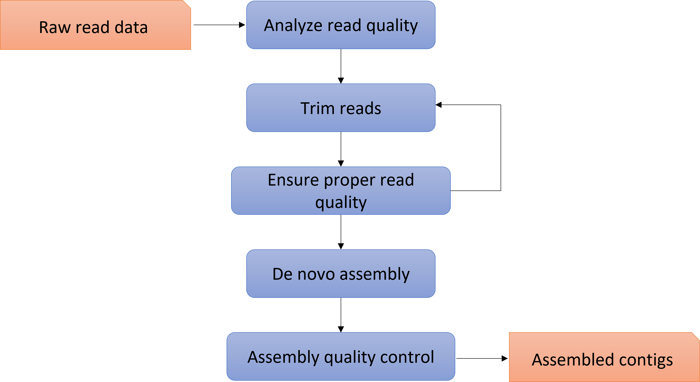
  

# Detailed pipeline

  
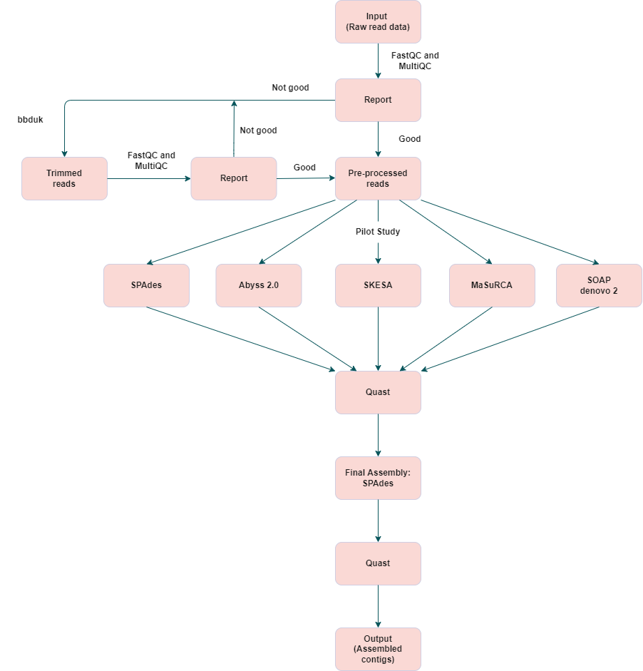
  

# Quality Control and Trimming
## Quality Control: FastQC on raw isolate files

All 50 isolate paired-end (PE) read files were run through <u>FastQC</u> [1] and aggregated into a single report using <u>MultiQC</u> [2]. Duplicate sequences were found in some isolates but were tolerable by FastQC. Warnings and failures were generated for Per base sequence quality and %GC content:

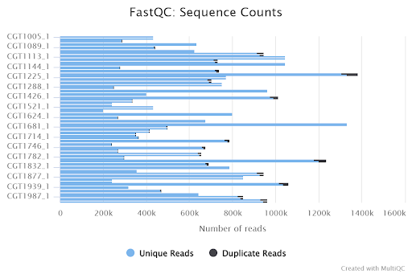  
*Figure 1. Number of total PE reads per isolate. (top plot bar = forward strand reads, bottom plot bar = reverse strand reads)*   
  
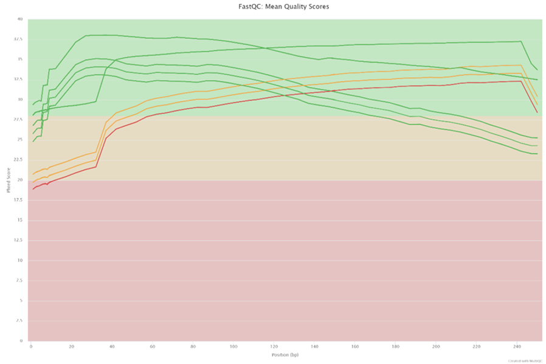  
*Figure 2. Mean quality score per isolate by base pair position in read.*  
  
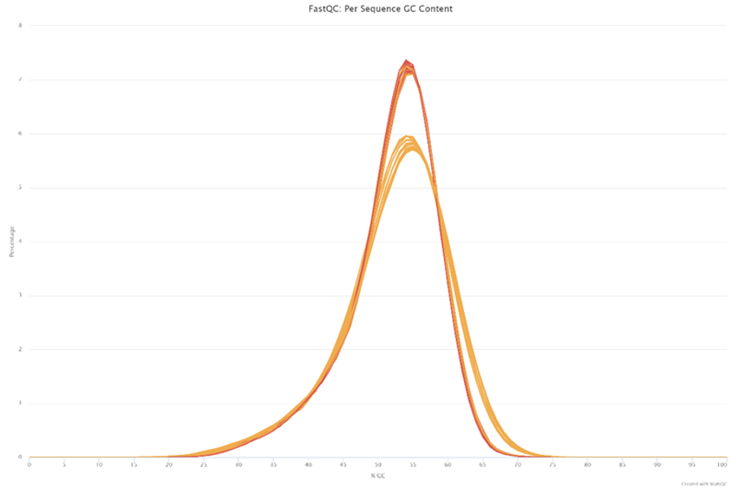  
*Figure 3. %GC content distribution by percentage of total number of isolates. (yellow= warning; red = failed)*
  
Although %GC content (<b>Fig. 3</b>) was considered high by FastQC, all isolates showed a mostly normal distribution with a central mean around ~54%. In the context of bacterial species, a higher %GC content may not be unexpected [3]. Therefore, these warnings or failures were not taken into consideration in the next pipeline operations.

However, <b>Figure 2</b> shows several isolate read files with quality scores in the “warning” (13 files) or “failure” (8 files) thresholds for per sequence base quality, indicating the presence of low-quality reads. Given this potential lack of quality reads and absence of other warnings/failures (e.g. presence of adapter sequences, high duplicates, etc.), trimming was done to address low base-quality scores only.

## Trimming: Sequence trimming with BBDuk

<u>BBDuk</u> or BB "Decontamination Using Kmers" is a comprehensive tool set that combines multiple commonly used trimming options into one package [4]. To trim low-quality bases, only the `qtrim` and `trimq` options were selected when running passes through the isolates. These options were set such that:

`qtrim = rl, trimq = {Q-score threshold}`

Where `rl` means that each read will be evaluated in both the 5’ and 3’ direction and `Q-score threshold` represents the Q-score (or Phred Quality Score) at which a base was dropped in a read sequence.
  

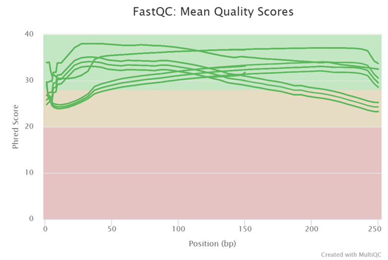  

*Figure 4. All post-trimming sequence quality scores passing in FastQC.*
  
For each isolate, FastQC was first performed. If FastQC results returned a warning or failure for “Basic Statistics” or “Per base sequence quality,” trimming was performed. The default Q-score threshold was set at 5 and increased by one until the read files for the isolate passed FastQC “Basic Statistics” and “Per base sequence quality.” Mean quality scores for the trimmed isolate reads are shown in <b>Figure 4</b>.

This process, however, did lead to a change in sequence distribution (<b>Figure 5</b>) where multiple sequences now showed a different distribution of sequence read lengths compared to the raw data which stated that all reads were at a length of either 150 or 250 bp. %GC content continued to generate warnings or failures.

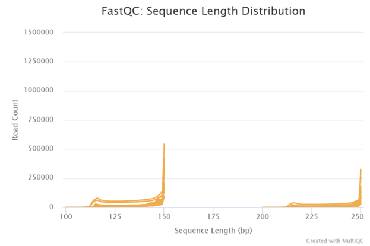  

*Figure 5. Distribution of read sequence lengths after trimming.*

# De Novo Assembly
Generally, there are two types of assembly methods: reference assembly and de novo assembly. The former one needs to use a reference genome, while de novo assembly does not. Through assembling the short continuous sequences called “contigs” by joining overlapping regions, de novo assembly is limited by the size and continuity of contigs [5], [6].

Since for the sequences we need to assemble, there is no reference genome to use, we selected several de novo assembly methods.

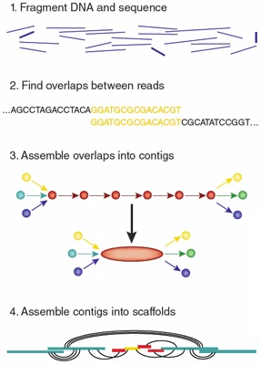

## Algorithms
The two most used algorithms for de novo assembly are overlap-layout-consensus (OLC) and de-bruijn-graph (DBG). OLC first finds the overlap regions, then generates the layout for all the reads and overlap information to make a graph to infer the consensus sequence. DBG cuts the reads into shorter overlapping k-mers, then uses these k-mers as vertices, connecting them through edges, to build a de Brujin graph. By finding paths to visit each edge once, sequences would be assembled. In most cases, OLC is suitable for long reads such as Sanger Sequencing, while DBG performs better on short reads such as Illumina Sequencing [7].

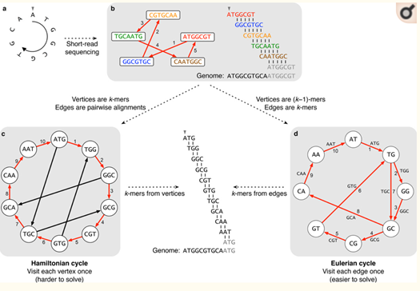

## Pilot Study

### Assemblers assessed in pilot study

**SoapDenovo [8]**: is a novel short-read assembly method that can build a de novo draft assembly for the human-sized genomes, especially for Illumina GA short reads.

**MaSuRCA [9]**: MaSuRCA is an assembler that was published in 2013, which uses the de Bruijn graph algorithm. It is a powerful assembler that accepts both short reads and long reads, being capable of assembling various kinds of genomes. MaSuRCA utilizes modules including QuorUM error correction, gap filling, jumping library filter, and automatically determines the length of k-mers.

**Abyss [10]**: **Abyss 1.0** is a multistage assembly pipeline constituting three stages - unitig, contig and the scaffold stage. To address the issue of large memory consumption, they innovated the **Abyss 2.0** version which is based on a Bloom-filter implementation of the unitig assembly stage. During the unitig assembly, two passes are made to the sequence reads. In the first pass, the k-mers from the reads are extracted and loaded into the Bloom filter. To filter out the k-mers caused by sequencing errors, all the k-mers below the specified threshold by the user typically in the range of 2-4 are discarded, thereby retaining the solid k-mers. During the second pass, all the reads consisting of solid k-mers are identified and extended on both sides (left and right) within the de Bruijn graph to produce unitigs. Read extension adopts the same graph traversal approach as Minia. As only the nodes and not the edges of the De Bruijn graph are present in the Bloom filter, all four k-mers neighboring the current k-mer are queried in every step of the graph traversal. To avoid the duplicate sequences during the extension phase of assembly leading to the same unitig, an additional tracking Bloom filter to keep a record of the k-mers from the previous unitigs has been implemented. Abyss can be used for both single-end and paired-end reads. 

**SKESA [11]**: SKESA (Strategic Kmer Extension for Scrupulous Assemblies) is a sequence read assembler for microbial genomes (designed for haploid genomes and Illumina reads) and is based on DeBruijn graphs. It uses conservative heuristics and is designed to create breaks at repeat regions in the genome. This leads to excellent sequence quality without significantly compromising contiguity. It can use k-mers longer than mate length and up to the insert size which allows it to attain good contiguity as determined by the N50 score. It is a multi-threaded application that scales well with the number of processors. For different runs with the same inputs, including the order of reads, the order and orientation of contigs in the output is deterministic. SKESA can process read information by accessing reads from SRA or from files format. Any combination of input streams is allowed. Files could be in fasta or fastq format and gzipped, which is recognized automatically.

**SPAdes [12]**: 
 SPAdes (St. Petersburg genome assembler) is a de-novo genome assembly tool which is optimized for single cell and multi-cells bacterial datasets. The unique thing about Spades is that it uses Multisized de-bruijn graphs. SPAdes supports paired-end reads, mate-pairs (including high quality Nextera Mate Pairs) and unpaired reads. Spades uses several modules; the following are prominently used:
- BayesHammer – a read error correction tool that Spades uses in its Pipeline.
- SPAdes-module – the actual iterative short-read genome assembly module, where values of K are selected automatically based on the read length and sequence type.

Spades performs assembly essentially in 4 stages:
- Stage 1: Assembly Graph construction, as mentioned above, uses multisized debruijn approach, algorithms for bulge/bubble removal are also implemented in this stage.
- Stage 2: Distance between the K-mers i.e. the edges in the de-bruijn graphs are  computed. This is also referred to as K-Bimer adjustment.
- Stage 3: The actual paired assembly graph is constructed.
- Stage 4: Spades outputs the contigs and performs mapping of the contigs to reads via Backtracking.

`spades.py` is the main script that needs to be run; the actual command  for paired end reads with read-error correction (default) is:  
`spades.py --pe1-1 {left paired end read file} --pe1-2 {right paired end read file} -o {output directory}`

For Assemblers like **AbySS**, **MaSURCA**, etc, the value of K has to be optimized manually based on the assembly quality. SPAdes solves this problem by producing assemblies for different K values. 

In Spades, the concept of multisized graphs is used in assembly graphs rather than the de-bruijn graphs. The multisized graph entailing the smaller K values can be used to compute the multisized assembly graph with higher K values and eventually the whole multisized graph for all the considered K values. It also uses the Paired de-bruijn graphs **(PDBG)** approach.

The actual Spades pipeline uses K values **21, 33, 55, 77, and 127** and the final file `contigs.fasta` is computed. This is exactly complemented in the results, as Spades has better N50 values than most of the assemblers. It's also much faster than Abyss and MaSuRCA.

### Evaluating the assemblers
Quality Assessment Tool for Genome Assemblies (QUAST) [13] was used to evaluate the quality after different assembly tools. The assembly quality was assessed using the assembly score formula below, developed by Lee Katz and Lava Rishishwar, that incorporates total assembly length, N50 score (length of the contig at the midpoint when contigs are ordered by increasing length), and the number of contigs.

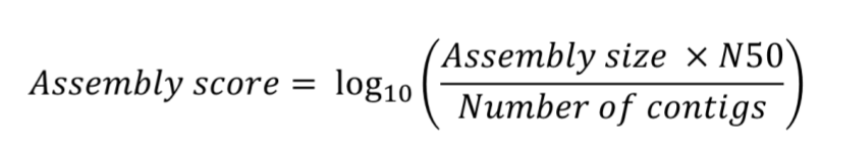

### Pilot Study Results

In our pilot study, we first compared 5 different tools (Abyss, MaSuRca, SKESA, SoapDenovo and SPAdes) on a random set of 10 isolates, using QUAST to generate quality metrics. MaSuRca and SPAdes have better scores among the tools, however, MaSuRca assemblies for each isolate took at least 1 hour, with multithreading enabled. Considering this, and since no other assembler’s assembly score ranges overlapped with the range of the SPAdes assemblies, we decided to use only SPAdes for our final assemblies. Although the distribution in Final Assembly (50 isolates) is slightly different from pilot results, it is still a competitive and efficient method for Gene Assembly.   

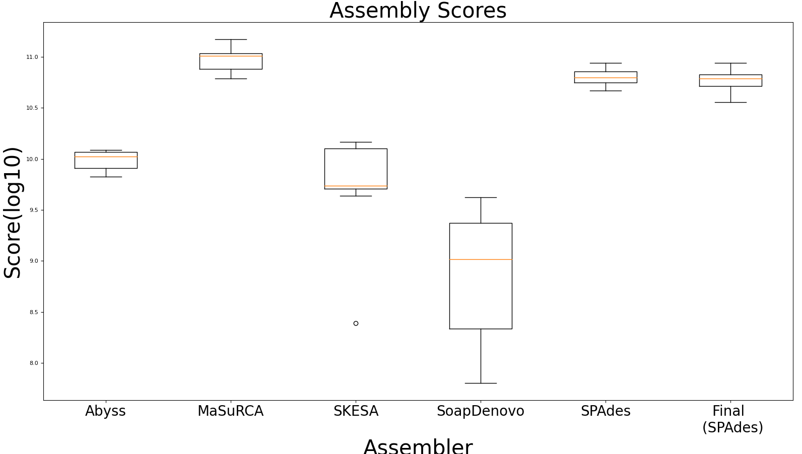

The box plots above show a comparison between the five assemblers (Abyss, MaSurCa, SKESA, SoapDenovo and SPAdes) for assembly scores. We also include the assembly scores for the final assemblies (next section) generated with SPAdes.

## Final Assemblies

The final assemblies were generated with SPAdes.

### Evaluation of the final assemblies using various metrics

#### Assembly Scores
The mean of all the assembly scores came out to be 10.7746. As can also be seen by the plot shown below:
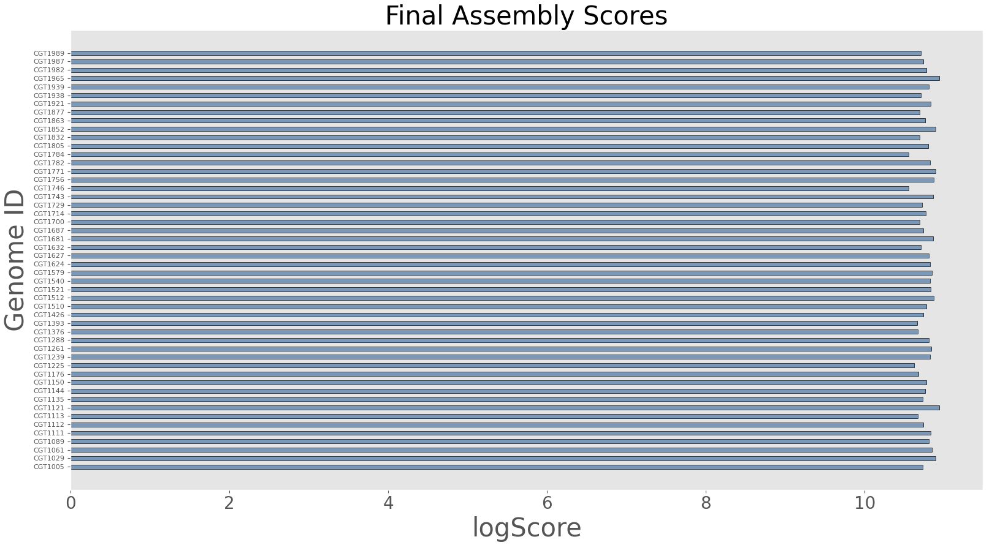

#### N50 scores
The mean N50 statistic according to the assemblies for each isolate is 406604.28 bp.
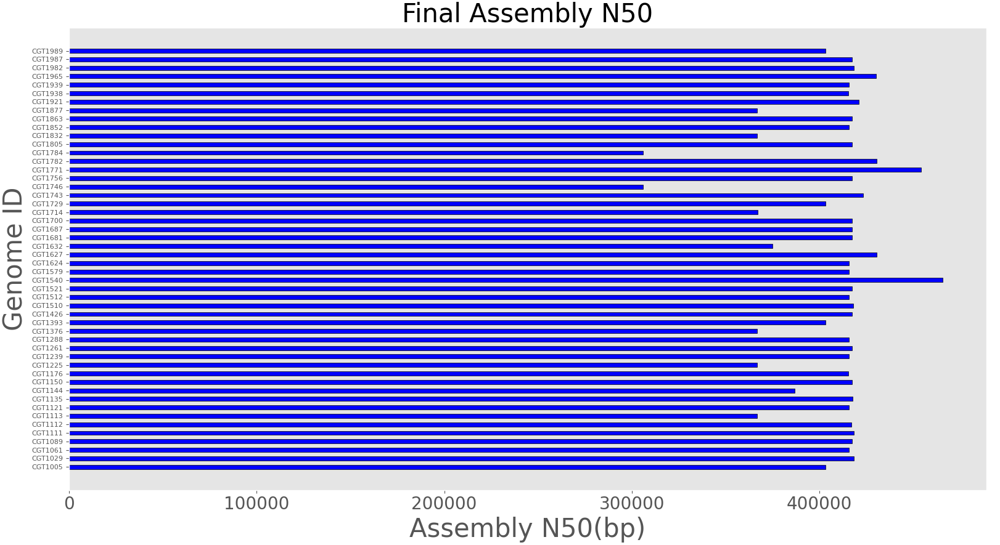

#### Assembly Size
The closer the assembly size is to the actual length of the genome for the isolate, the better the assembly. Thus, the longer the assembly size the better. As per the assembly QUAST results, the mean assembly size for all our 50 isolates is 4798815.02 bp.

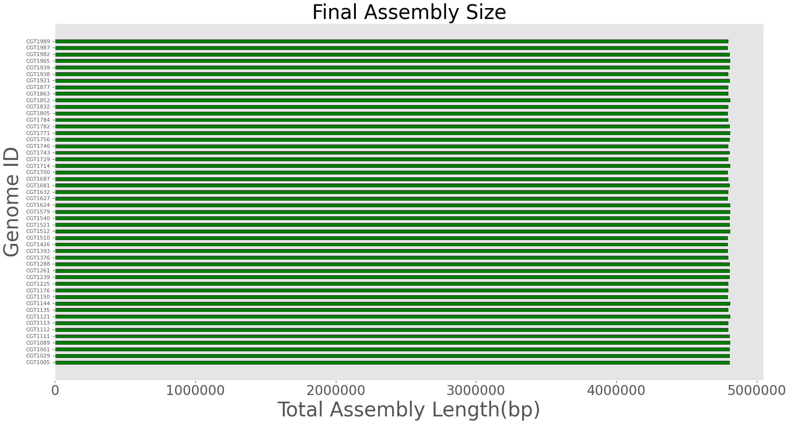

#### Number of Contigs
The average number of contigs of size >=500 bp is 33.

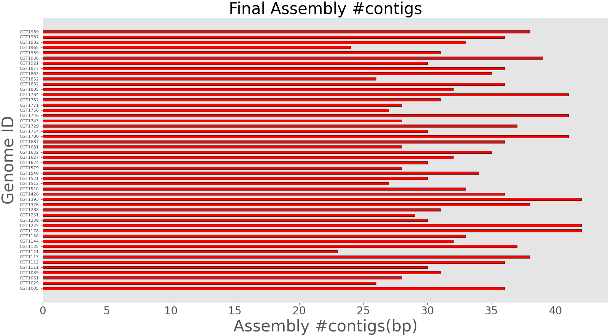

# References

1.  S. Andrews, “FastQC: a quality control tool for high throughput sequence data,” 2010.
2.	“MultiQC: summarize analysis results for multiple tools and samples in a single report | Bioinformatics | Oxford Academic.” https://academic.oup.com/bioinformatics/article/32/19/3047/2196507?login=true (accessed Feb. 21, 2022).
3.	F. Hildebrand, A. Meyer, and A. Eyre-Walker, “Evidence of Selection upon Genomic GC-Content in Bacteria,” PLOS Genet., vol. 6, no. 9, p. e1001107, Sep. 2010, doi: 10.1371/journal.pgen.1001107.
4.	“BBMap,” SourceForge. https://sourceforge.net/projects/bbmap/ (accessed Feb. 21, 2022).
5.	M. Baker, “De novo genome assembly: what every biologist should know,” Nat. Methods, vol. 9, no. 4, Art. no. 4, Apr. 2012, doi: 10.1038/nmeth.1935.
6.	“De Novo Sequencing | Assemble novel genomes.” https://www.illumina.com/techniques/sequencing/dna-sequencing/whole-genome-sequencing/de-novo-sequencing.html (accessed Feb. 21, 2022).
7.	“Comparison of the two major classes of assembly algorithms: overlap–layout–consensus and de-bruijn-graph | Briefings in Functional Genomics | Oxford Academic.” https://academic.oup.com/bfg/article/11/1/25/191455?login=true (accessed Feb. 21, 2022).
8.	“SOAPdenovo2: an empirically improved memory-efficient short-read de novo assembler | GigaScience | Oxford Academic.” https://academic.oup.com/gigascience/article/1/1/2047-217X-1-18/2656146?login=true (accessed Feb. 21, 2022).
9.	A. V. Zimin, G. Marçais, D. Puiu, M. Roberts, S. L. Salzberg, and J. A. Yorke, “The MaSuRCA genome assembler,” Bioinformatics, vol. 29, no. 21, pp. 2669–2677, Nov. 2013, doi: 10.1093/bioinformatics/btt476.
10.	S. D. Jackman et al., “ABySS 2.0: resource-efficient assembly of large genomes using a Bloom filter,” Genome Res., vol. 27, no. 5, pp. 768–777, May 2017, doi: 10.1101/gr.214346.116.
11.	A. Souvorov, R. Agarwala, and D. J. Lipman, “SKESA: strategic k-mer extension for scrupulous assemblies,” Genome Biol., vol. 19, no. 1, p. 153, Oct. 2018, doi: 10.1186/s13059-018-1540-z.
12.	“SPAdes: A New Genome Assembly Algorithm and Its Applications to Single-Cell Sequencing | Journal of Computational Biology.” https://www.liebertpub.com/doi/full/10.1089/cmb.2012.0021 (accessed Feb. 21, 2022).
13.	A. Gurevich, V. Saveliev, N. Vyahhi, and G. Tesler, “QUAST: quality assessment tool for genome assemblies,” Bioinformatics, vol. 29, no. 8, pp. 1072–1075, Apr. 2013, doi: 10.1093/bioinformatics/btt086.
